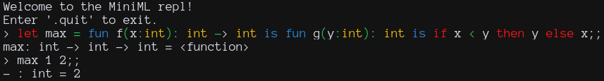

# miniml

Implementation of the MiniML language from
[plzoo](https://github.com/andrejbauer/plzoo) in various programming languages.

This is meant to be a way for people to learn how to make a basic statically
typed programming language in a few lines of code.

## Contributing

Please feel free to open a PR adding your implementation. A few notes:

- All implementations must expose a TCP server on port 3693 to communicate with
  the shared REPL.
- This server must read a line and respond with the appropriate result or error
  message.

## License

MIT
